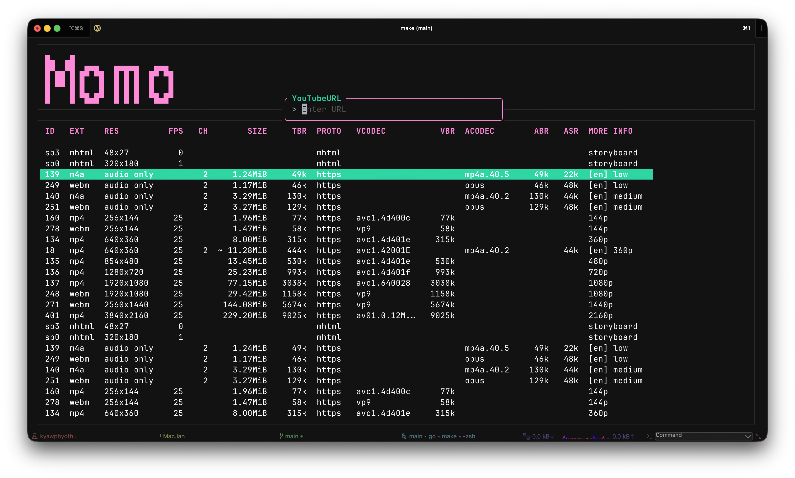

```
 ▄    ▄
 ██  ██  ▄▄▄   ▄▄▄▄▄   ▄▄▄
 █ ██ █ █▀ ▀█  █ █ █  █▀ ▀█
 █ ▀▀ █ █   █  █ █ █  █   █
 █    █ ▀█▄█▀  █ █ █  ▀█▄█▀
```



## Features

- [x] Download YouTube videos
- [x] Download YouTube videos in different formats
- [x] Download YouTube videos in different resolutions
- [x] Download YouTube videos in different audio qualities
- [x] Download YouTube videos in different video qualities
- [x] Download YouTube videos in different formats
- [x] Download YouTube videos in different resolutions
- [x] Download YouTube videos in different audio qualities
- [x] Download YouTube videos in different video qualities

## Keybindings

- `q` to quit the application
- `l` to open the YouTube URL input field
- `esc` to close the YouTube URL input field
- `enter` to fetch the formats
- `up`/`down` to navigate the formats
